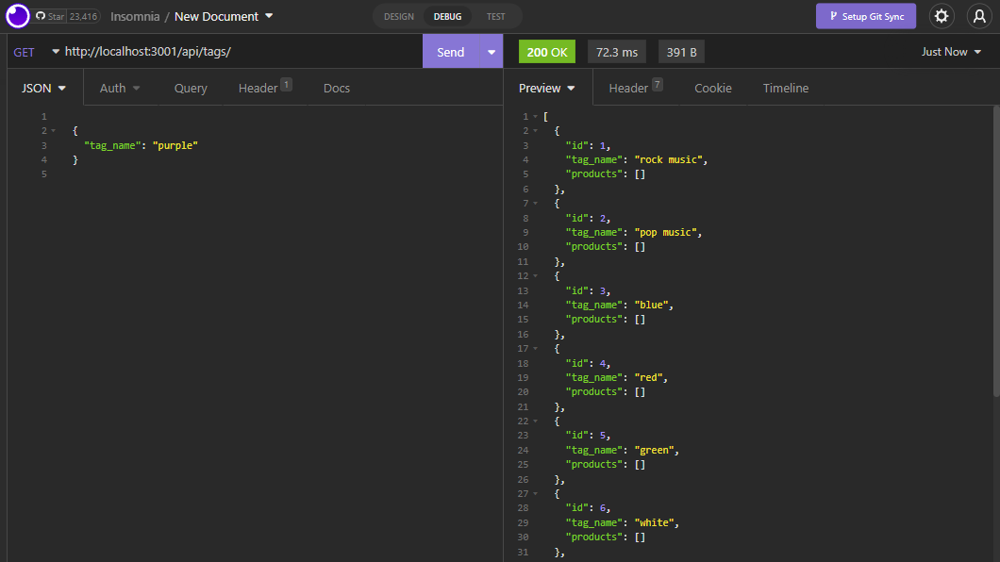

# E-Commerce Site

[Video Demonstration of the Application](https://drive.google.com/file/d/1HEJIsAyH8yp1CDKX8FhM7LAVE4ASFxI9/view)

## Description
Database for storing and retrieving data related to e-commerce.

## Table of Contents
- [Installation](#installation)
- [Usage](#usage)
- [Credits](#credits)

## Installation
N/A

## Usage
Keeping track of product prices and organizing them based on categories/tags.

## Contributing
N/A

## Tests
N/A

## Questions
If you have any questions related to this project, contact through my [GitHub](https://github.com/kieferjackson) or contact at the following email address: [kieferleejackson@gmail.com](kieferleejackson@gmail.com)

## Credits
This project was developed by [kieferjackson](https://github.com/kieferjackson)
